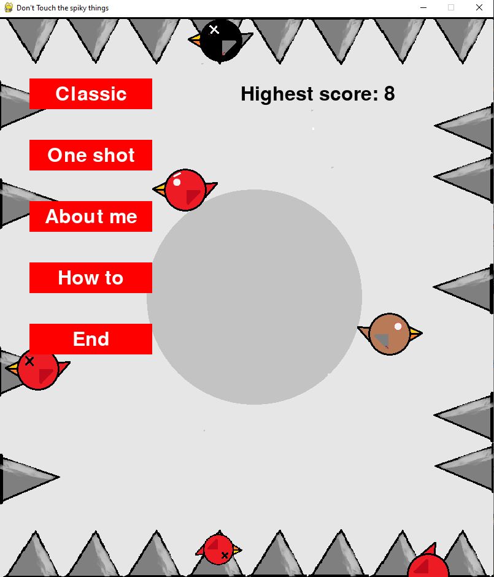
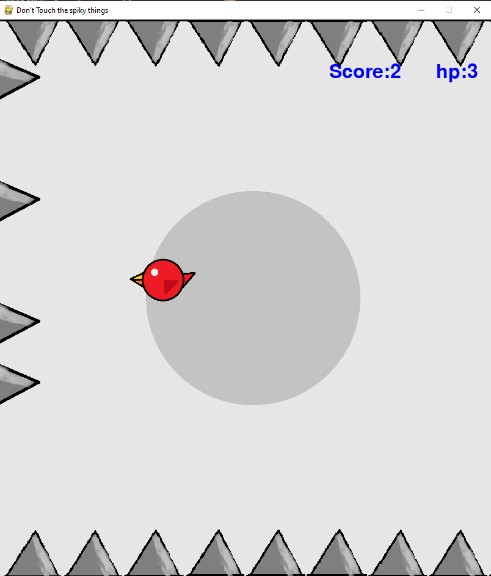

# projekt-programowanie
Repozytorium do gry z programowania

Jest to gra wzorowana na grze "Don't touch the spikes".

Zdobywaj punkty latając i unikając zagrożeń w postaci kolców- najgorszych wrogów wszystkich ptaków. Wielu już poległo, ale w Tobie jeste nadzieja! 

## Zasady:
* Skacz ptakiem w górę używając spacji
* Odbijaj się od boków ekranu unikając przy tym kolców
* Uważaj, żeby nie latać za nisko, ani za wysoko!

## Tryb Classic:
* Ptak posiada trzy punkty, życia
* Zdrowie regeneruje się w miare zdobywania punktów

## Tryb One-shot:
* Ptak posiada jedno życie

